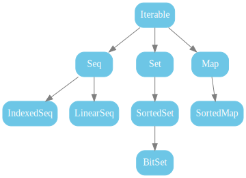
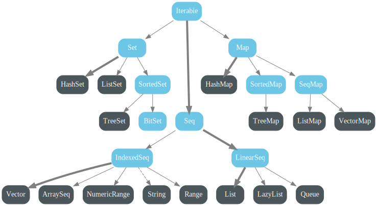
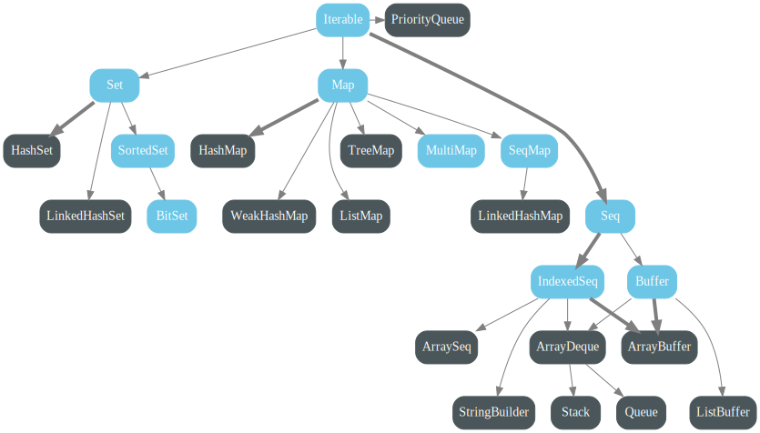

# Scala collection
---
## Коллекции

* списки
* множества
* наборы
* массивы
* вектора
* Option


---
### Списки. List

 * однородны
   * List[String] не может содержать элементы Int
 * ковариантны
   * если T подтип S, то и List[T] подтип List[S]
    
    
    
---
### List. Создание 1
```scala 
val list0 = List() 
//list0: List[Nothing] = List()

val list1 = List(1, 2, 3) 
//list1: List[Int] = List(1, 2, 3)

val list2 = List.range(1,5) 
//list2: List[Int] = List(1, 2, 3, 4)
val list2a = List.range(1, 5, 2) 
//list2a: List[Int] = List(1, 3)

val list3 = List.fill(5)("lol") 
//list3: List[String] = List("lol", "lol", "lol", "lol", "lol")

val list4 = List.tabulate(5)(n => n/2.0) 
//list4: List[Double] = List(0.0, 0.5, 1.0, 1.5, 2.0)

```


---
### List. Создание 2

Nil - пустой список
```scala
val empty = Nil 
//empty: Nil.type = List()


val list = 3 :: 2 :: 1 :: Nil 
//list: List[Int] = List(3, 2, 1)

val d = Nil 
//d: Nil.type = List()
val c = 3 :: d 
//c: List[Int] = List(3)
val b = 2 :: c 
//b: List[Int] = List(2, 3)
val a = 1 :: b 
//a: List[Int] = List(1, 2, 3)

```


---
### List. Шаблоны
```scala
val List(a, b, c) = List(1, 2, 3) 
//a: Int = 1
//b: Int = 2
//c: Int = 3

val x :: y :: z = List(1, 2, 3) 
//x: Int = 1
//y: Int = 2
//z: List[Int] = List(3)
```


---
### List. Шаблоны
```scala
val List(a, b, c) = List(1, 2, 3, 4) 
//scala.MatchError: List(1, 2, 3, 4) (of class 
//  scala.collection.immutable.$colon$colon)
//  ammonite.$sess.cmd33$.<clinit>(cmd33.sc:1)

val x :: y :: z = List(1, 2, 3, 4, 5) 
//x: Int = 1
//y: Int = 2
//z: List[Int] = List(3, 4, 5)

val x :: y :: z = List(1, 2) 
//x: Int = 1
//y: Int = 2
//z: List[Int] = List()

```


---
### Методы. head, tail, isEmpty
```scala
val head = List(1, 2, 3, 4, 5).head 
//head: Int = 1

val tail = List(1, 2, 3, 4, 5).tail 
//tail: List[Int] = List(2, 3, 4, 5)

val isEmpty = List(1, 2, 3, 4, 5).isEmpty 
//isEmpty: Boolean = false

val isEmptyNil = Nil.isEmpty 
//isEmptyNil: Boolean = true
```

---
### List. много других методов
* Scala предоставляет множество методов для работы с коллекциями
* Начнем с методов первого порядка

---
### ::: Объединение списков

```scala
val `2list1` = List(1, 2) ::: List(3, 4, 5) 
//`2list1`: List[Int] = List(1, 2, 3, 4, 5)

val `2list2` = List(1, 2) ::: List(3, 4, 5) 
//`2list2`: List[Int] = List(1, 2, 3, 4, 5)
```

---
### length, indices

```scala
val len1 = List(1, 2, 3).length
//len1: Int = 3

val len2 = List().length 
//len2: Int = 0

val len3 = Nil.length 
//len3: Int = 0

val idx1 = List(1, 2, 3).indices 
//idx1: Range = Range(0, 1, 2)

val idx2 = Nil.indices 
//idx2: Range = Range()
```


---
###  init, last. Конец и начало

```scala
val abcde = List('a', 'b', 'c', 'd', 'e') 
//abcde: List[Char] = List('a', 'b', 'c', 'd', 'e')

val last1 = abcde.last 
//last1: Char = 'e'

val init1 = abcde.init 
//init1: List[Char] = List('a', 'b', 'c', 'd')

List().init 
//java.lang.UnsupportedOperationException: init of empty list
//  scala.collection.immutable.Nil$.init(List.scala:596)
//  ...

List().last 
//java.util.NoSuchElementException: last of empty list
//  scala.collection.immutable.Nil$.last(List.scala:595)
//  ...
```


---
### reverse


```scala
val edcba = List("e", "d", "c", "b", "a") 
//edcba: List[String] = List("e", "d", "c", "b", "a")

val reverse1 = edcba.reverse 
//reverse1: List[String] = List("a", "b", "c", "d", "e")
```


---
### reverse для внимательных

```
lst.reverse.init <=> lst.tail.reverse
lst.reverse.tail <=> lst.init.reverse
lst.reverse.head <=> lst.last
lst.reverse.last <=> lst.head
```


---
### drop, take и splitAt

```scala
val teke1 = abcde.take(2) 
//teke1: List[Char] = List('a', 'b')

val drop1 = abcde.drop(2) 
//drop1: List[Char] = List('c', 'd', 'e')

val splitat1 = abcde.splitAt(2) 
//splitat1: (List[Char], List[Char]) = (List('a', 'b'), List('c', 'd', 'e'))

```


---
###  flatten

```scala
val flatten1 = List(List(1, 2), List(3), List(), List(4,5)).flatten 
//flatten1: List[Int] = List(1, 2, 3, 4, 5)

val flatten2 = List(1, 2, 3).flatten 
//cmd22.sc:1: No implicit view available from Int => scala.collection.IterableOnce[B].
//val flatten2 = List(1, 2, 3).flatten                                                                                                                  
//                             ^
//Compilation Failed

val flatten3 = List(List(List(), List(1)), List(List(2))).flatten 
//flatten3: List[List[Int]] = List(List(), List(1), List(2))
```


---
### zip и unzip

```scala
val abcde = List('a', 'b', 'c', 'd', 'e') 

val zip1 = abcde.indices.zip(abcde) 
//zip1: IndexedSeq[(Int, Char)] = Vector((0, 'a'), (1, 'b'), (2, 'c'), (3, 'd'), (4, 'e'))

val zip2 = abcde.zip(List(1, 2, 3)) 
//zip2: List[(Char, Int)] = List(('a', 1), ('b', 2), ('c', 3))

val zipIdx = abcde.zipWithIndex 
/zipIdx: List[(Char, Int)] = List(('a', 0), ('b', 1), ('c', 2), ('d', 3), ('e', 4))

val unzip = zip2.unzip 
//unzip: (List[Char], List[Int]) = (List('a', 'b', 'c'), List(1, 2, 3))
```


---
### toString

```scala
val abcde = List('a', 'b', 'c', 'd', 'e') 
val abcStr = abcde.toString 
//abcStr: String = "List(a, b, c, d, e)"

val list = List(1, 2, 3, 4, 5)
val lstStr = list.toString 
lstStr: String = "List(1, 2, 3, 4, 5)"

```


---
### mkSting

```scala
val str1 = abcde.mkString ("[", ",", "]") 
//str1: String = "[a,b,c,d,e]"

val str2 = abcde.mkString ("", ",", "") 
//str2: String = "a,b,c,d,e"

val str3 = abcde.mkString (",") 
//str3: String = "a,b,c,d,e"

val str4 = abcde.mkString (",", "]") 
//cmd37.sc:1: overloaded method value mkString with alternatives:
//val str4 = abcde.mkString (",", "]")
//                 ^
//Compilation Failed
```


---
### List. методы высшего порядка
 
 У многих операций над списками схожая структура. Раз за разом
используются несколько схем. К подобным примерам можно
отнести какое-либо преобразование каждого элемента списка,
проверку того, что свойство соблюдается для всех элементов
списка, извлечение из списка элементов, удовлетворяющих каким-
то критериям, или объединение элементов списка с
использованием какого-нибудь оператора. В Java подобные схемы
будут, как правило, созданы идиоматическими комбинациями
циклов for или while. В Scala они могут быть выражены короче и
непосредственнее за счет использования операторов высшего
порядка103, которые реализуются в виде методов, определенных в
классе List. Этим операторам высшего порядка и посвящен
данный раздел.

 
---
### 

```scala


```


---
### 

```scala


```


---
### 


---

### map, foreach
```scala
val abc = List(97 ,98, 99).map(_.toChar) 
//abc: List[Char] = List('a', 'b', 'c')

abc.foreach(println)
//a
//b
//c

```


---
### filter, partition

```scala
val filter1 = List(1, 2, 3, 4, 5).filter(_ % 2 == 0) 
//filter1: List[Int] = List(2, 4)

val filter2 = List(1, 2, 3, 4, 5).filter(_ < 0)  
/filter2: List[Int] = List()

val partition1 = List(1, 2, 3, 4, 5).partition(_ % 2 == 0) 
//partition1: (List[Int], List[Int]) = (List(2, 4), List(1, 3, 5))

val partition2 = List(1, 2, 3, 4, 5).partition(_ < 0) 
//partition2: (List[Int], List[Int]) = (List(), List(1, 2, 3, 4, 5))

```

---
### find

```scala
val find1 = List(1, 2, 3, 4, 5).find(_ % 2 == 0) 
//find1: Option[Int] = Some(2)

val find2 = List(1, 2, 3, 4, 5).find(_ <= 0) 
//find2: Option[Int] = None
```

---
### takeWhile, dropWhile

```scala


```


---
### span

```scala


```

---
### forAll, exist, contains

```scala


```


---
### :\ /:

```scala


```


---
### sortWith

```scala
val sort1 = List(10, 5, 8, 1, 7).sortWith(_ > _) 
//res22: List[Int] = List(10, 8, 7, 5, 1)

val sort2 = List("banana", "pear", "apple", "orange").sortWith(_ < _) 
//sort2: List[String] = List("apple", "banana", "orange", "pear")

val sort3 = List("banana", "pear", "apple", "orange").sortWith(_.length < _.length) 
//sort3: List[String] = List("pear", "apple", "banana", "orange")
```

---
### sorted

```scala
val a = List(10, 5, 8, 1, 7).sorted
//sort4: List[Int] = List(1, 5, 7, 8, 10)
```

---
### не всё умеет sorted*

```scala
case class Cat (name: String, age: Int)
val s = collection.SortedSet(Cat("Мурзик", 2), Cat("Murka", 1))
//  error: No implicit Ordering defined for Person.
```

---
### sorted по максимому

```scala
case class Cat (name: String, age: String) extends Ordered [Cat] {
    def compare (that: Cat): Int = {
        if (this.name == that.name)
            0
        else if (this.name > that.name)
            1
        else 
            0−1 //ammonite ломается
    }
}
```

---
### Чего же есть другого?


---
### Array
```scala
val arr1 = new Array[Int](5) 
//arr1: Array[Int] = Array(0, 0, 0, 0, 0)

val arr2 = Array(5, 4, 3, 2, 1) 
//arr2: Array[Int] = Array(5, 4, 3, 2, 1)

val arr3 = Array(5) 
arr3: Array[Int] = Array(5)

```

---
### Set, Map

* Set - множество ункальных значений
* Map - можество уникальных отображений


---
### Set

```scala
val str = "Беги Лола, беги!" 
//str: String = "Беги Лола, беги!"

val split = str.toLowerCase.split("[ !,]+") 
//split: Array[String] = Array("беги", "лола", "беги")

var set = collection.mutable.Set.empty[String] 
//set: collection.mutable.Set[String] = HashSet()

for (word <- split)
    set += word 
//set: collection.mutable.Set[String] = HashSet("беги", "лола")
```


---
### Map

```scala
val map1 = Map("one" -> 1, "two" -> 2) 
//map1: Map[String, Int] = Map("one" -> 1, "two" -> 2)

val map2 = Map("one" -> 1, "two" -> 3, "three" -> 3, "two" -> 2) 
//map2: Map[String, Int] = Map("one" -> 1, "two" -> 2, "three" -> 3)


```


---
### TreeSet, TreeMap
SortedSet
```scala
import scala.collection.immutable.TreeSet
val tSet1 = TreeSet(9, 4, 5, 3, 2, 5, 8) 
//tSet1: TreeSet[Int] = TreeSet(2, 3, 4, 5, 8, 9)

val tSet2 = TreeSet('h', 'e', 'l', 'l', 'o') 
//tSet2: TreeSet[Char] = TreeSet('e', 'h', 'l', 'o')
```


SortedMap
```scala
import scala.collection.immutable.TreeMap
var tMap = TreeMap(3 -> 'c', 1 -> 'b', 4 -> 'a') 
//tMap: TreeMap[Int, Char] = TreeMap(1 -> 'b', 3 -> 'c', 4 -> 'a')
```
---
### iterator

просто для понимания, что это основной тип
```scala
val it = Iterator("су", "е", "фа")
while (it.hasNext)
  println(it.next())
```


---
### mutable immutable
* scala.collection
  - immutable
  - mutable
  - generic
  - concurrent

  
```scala
scala.collection.immutable.List 
scala.List                     
List                                                
```


---
### 

<center>

</center>

---
### 

<center>

</center>

---
### span

<center>

</center>

---
### Равенство
* Set
* Map
* Seq


### Равенство
```scala
Set(1, 2, 3) != List(1, 2, 3)

Set(1,3,2) == Set(1,2,3)

```

---
### Равенство

- mutable
- immutable
- НЕ-ВА-ЖНО

---
### Scala <=> Java
```scala
import collection.JavaConverters._
// import scala.jdk.CollectionConverters._ //2.13.0

val j1 = java.util.Arrays.asList("hey", "lol")
val j1s = j1.asScala
//j1s: collection.mutable.Buffer[String] = Buffer("hey", "lol")

val s1 = Seq("one", "dva")
val s1j = s1.asJava
//java.util.List[String] = SeqWrapper(List("one", "dva"))

```


---
### Scala <=> Java
```sh
Iterator               <=>     java.util.Iterator
Iterator               <=>     java.util.Enumeration
Iterable               <=>     java.lang.Iterable
Iterable               <=>     java.util.Collection
mutable.Buffer         <=>     java.util.List
mutable.Set            <=>     java.util.Set
mutable.Map            <=>     java.util.Map
mutable.ConcurrentMap  <=>     java.util.concurrent.ConcurrentMap
```


### Scala => Java

```sh
Seq           =>    java.util.List
mutable.Seq   =>    java.util.List
Set           =>    java.util.Set
Map           =>    java.util.Map
```

---
### сортируем пузырьком

```sh
 ЦИКЛ ДЛЯ J=1 ДО N-1 ШАГ 1
   F=0 
   ЦИКЛ ДЛЯ I=1 ДО N-J-1 ШАГ 1 
     ЕСЛИ A[I] > A[I+1] ТО ОБМЕН A[I],A[I+1]:F=1
   СЛЕДУЮЩЕЕ I  
   ЕСЛИ F=0 ТО ВЫХОД ИЗ ЦИКЛА
 СЛЕДУЮЩЕЕ J         
```

---
### Scala в лоб


```scala
def bubblesort[A <: Ordered[A]](arr: Array[A]) : Array[A] {
  
  for (j <- 1 to arr.length-1) {
    for (i <- 0 to (arr.length-1-j)) {
      if (arr(i) > arr(i+1)){
        var t = arr(i)
        arr(i) = arr(i+1)
        arr(i+1) = t
      }
    }
  }
  arr
}
```


---
### Scala, когда не убъют

```scala
def bubblesort[A <: Ordered[A]](list: List[A]): List[A] = {
  def sort(as: List[A], bs: List[A]): List[A] =
    if (as.isEmpty) bs
    else bubble(as, Nil, bs)

  def bubble(as: List[A], zs: List[A], bs: List[A]): List[A] = as match {
    case h1 :: h2 :: t =>
      if (h1 > h2) bubble(h1 :: t, h2 :: zs, bs)
      else bubble(h2 :: t, h1 :: zs, bs)
    case h1 :: Nil => sort(zs, h1 :: bs)
  }

  sort(list, Nil)
}
```
